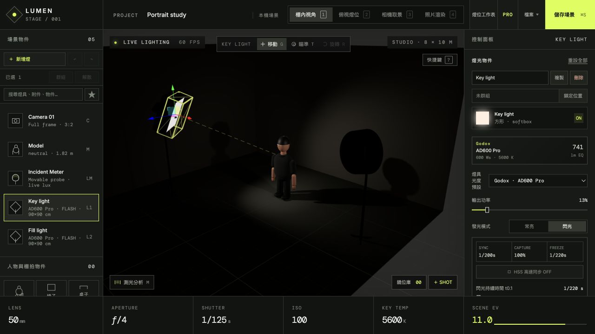

# Lumen Stage

Lumen Stage 是一套在瀏覽器中運作的 3D 攝影棚燈光與相機模擬器，讓使用者配置燈具、調整曝光與鏡頭參數，並預覽或輸出拍攝結果。

官方網站：[lumen-stage.vercel.app](https://lumen-stage.vercel.app) · [直接開啟攝影棚](https://lumen-stage.vercel.app/studio)



## 主要功能

- 棚內、俯視燈位、相機取景與照片渲染等多種檢視模式
- 參數化人體：體型、性別骨架、身高皆可調，不必依賴固定模型庫
- 全身骨架姿勢系統（頭頸、脊椎、雙臂、手掌、雙腿、表情），內建 28 組姿勢庫
- 場景內直接拖曳關節擺姿勢：手腕、腳踝與頭部有可拖把手，雙骨鏈以解析解反推關節角度
- 髮型、服裝與布料材質選擇；程序化生成皮膚毛孔、織紋與髮絲貼圖
- 真實器材目錄：燈頭、塑光附件、色片（CTO / CTB / ND / 色彩效果，含透光損失與 mired 位移）
- 背景系統：無縫背景紙、手繪畫布、PVC 與實體牆面，附反射率資料與捲軸掃地弧度
- 15 組經典燈位預設庫（林布蘭、蝴蝶光、蚌殼光、低調、三點打光…），含配置原理說明
- 可調整燈具、柔光附件、曝光、白平衡、鏡頭與感光元件設定
- 景深、人物位置曝光估算、閃燈同步與構圖輔助分析
- 匯入 GLB／VRM 人物可直接套用同一套姿勢系統（自動對應 Mixamo、VRM、Ready Player Me 骨架，含手勢與表情變形）
- 場景內量測工具，回報直線距離、水平距離與高度差
- 燈架、道具與人物之間有實體佔位碰撞，燈具可依人物為中心以 15° / 25 cm 吸附
- 「複製分享連結」把整個場景壓進網址，不需伺服器即可分享
- 鏡位庫可擷取多組拍攝方案，並以滑桿或並排方式 A/B 比對
- 以漸進式路徑追蹤產生高品質預覽並輸出 PNG
- 場景可儲存在瀏覽器，也可匯入或匯出專案檔
- 產生燈位工作表，方便實際拍攝時重現配置
- 內建無工具列的 11 頁操作教學與閱讀進度
- 手機版簡易介面：燈位庫、主燈調整、取景與拍照四件事，桌機版與手機版共用同一份場景資料

## 本機執行

需要近期版本的 Node.js 與 npm。

```bash
npm install
npm run dev
```

依終端顯示的網址在瀏覽器開啟即可。建立正式版本：

```bash
npm run build
npm run preview
```

正式版驗證會同時執行場景分享、路由、儲存復原測試與完整 TypeScript 建置：

```bash
npm run check
```

## 正式網站

- `/`：三語產品首頁
- `/studio`：依螢幕寬度自動選擇完整或手機攝影棚
- `/privacy`、`/terms`、`/support`：隱私、使用條款與支援
- `/analyze`：Lumen Trace 照片後期分析工具

公開頁包含搜尋引擎 sitemap、社群分享圖、SoftwareApplication 結構化資料與 PWA manifest。攝影棚程式採延遲載入，因此訪客瀏覽首頁時不會預先下載完整 3D 引擎。

場景會同步保存到瀏覽器儲存與 IndexedDB 備援；清除網站資料仍可能移除專案，重要工作應使用「匯出備份」。匿名技術錯誤會送至同網域的 `/api/error-report`，內容不包含場景、照片、專案名稱或匯入檔案。

## 手機版

在手機或視窗寬度 900 px 以下開啟時，會自動切換到簡易介面：上方是 3D 攝影棚，下方三個分頁分別是燈位庫、燈光與相機，右下角的快門鍵直接輸出照片。燈光分頁可新增、命名與刪除燈具，並調整亮度、繞人物角度、距離、燈高、塑光附件與尺寸，以及色溫或 RGB 顏色；相機分頁則是取景、鏡頭、光圈、ISO、畫面方向與背景。

想強制指定介面時可加上網址參數：`?ui=mobile` 或 `?ui=full`；介面內的「完整版 / 手機版」按鈕會把選擇記在瀏覽器裡。兩種介面共用同一份場景狀態，手機上排好的燈位在桌機開啟時完全一致。

## 專案結構

```text
src/                         React 介面、攝影計算與 3D 場景
src/anatomy.ts               參數化人體測量與斷面放樣幾何
src/pose.ts                  骨架姿勢定義與姿勢庫
src/textures.ts              程序化材質貼圖（皮膚、布料、頭髮、背景）
src/wardrobe.ts              髮型、服裝與布料目錄
src/gels.ts                  色片目錄與透光／色溫換算
src/backdrops.ts             背景材質目錄與反射率
src/setups.ts                經典燈位預設庫
src/ik.ts                    骨架正逆運動學（雙骨鏈解析解）
src/retarget.ts              匯入模型的人形骨架對應與姿勢重定向
src/layout.ts                佔位碰撞、房間邊界與角度吸附
src/share.ts                 場景壓縮與分享連結
src/uiMode.ts                依螢幕寬度決定桌機或手機介面（可用 ?ui= 覆寫）
src/mobile.css               手機版介面樣式
src/components/              場景、控制面板、分析與工作表元件
src/components/MobileApp.tsx 手機版簡易介面
scripts/build_website_guide.py  網站使用教學 PDF 產生工具
output/pdf/                  已產生的網站使用教學
palace_*.jpg                 場景環境圖片
```

## 技術架構

介面以 React、TypeScript 與 Zustand 建立；3D 場景採用 Three.js、React Three Fiber 與 Drei。照片模式透過 `three-gpu-pathtracer` 漸進取樣，後製則包含鏡頭特性、色彩科學與感光元件效果模擬。

字型由 Google Fonts 載入，因此首次顯示時需要網路連線。部分 3D 功能需要支援 WebGL 的現代瀏覽器與較佳的圖形效能。

## 文件

完整操作說明可參考 [`output/pdf/LUMEN_STAGE_網站使用教學.pdf`](output/pdf/LUMEN_STAGE_網站使用教學.pdf)。

## 授權

目前尚未指定開源授權。原始碼可供檢視，但未明確授予重製、修改或散布權利。
