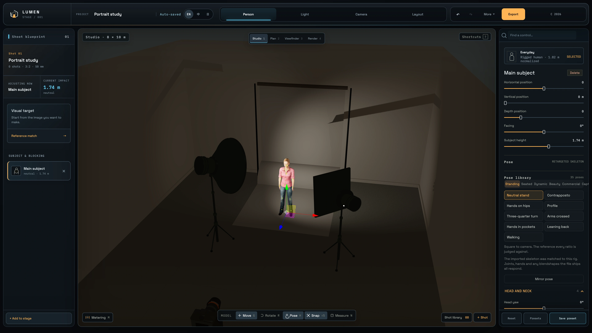
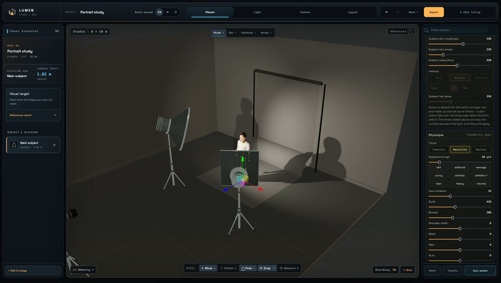
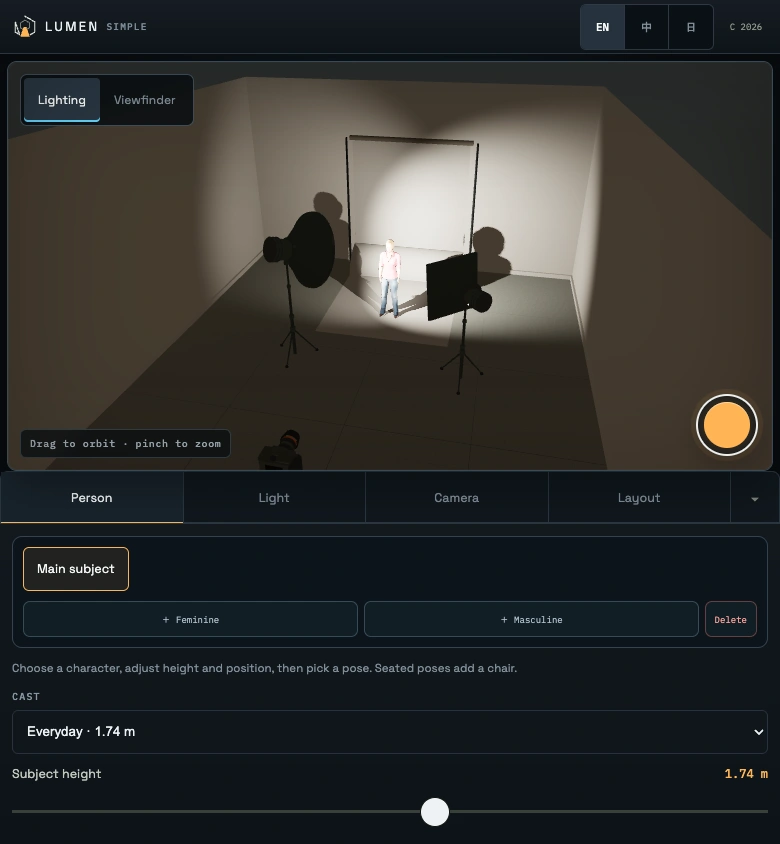

# Lumen Stage

**Plan the light. Frame the shot. Before the shoot.**

Lumen Stage is a browser-based 3D previsualization studio for photographers and learners. Build a lighting setup with real-world units, test camera and exposure choices, direct a cast member, and carry a repeatable plan to the shoot.

[Open Lumen Stage](https://lumen-stage.vercel.app) · [Launch the full studio](https://lumen-stage.vercel.app/studio?ui=full) · [Open the mobile studio](https://lumen-stage.vercel.app/studio?ui=mobile)



## What you can do

- Arrange lights, modifiers, flags, reflectors, backdrops, cameras, people, and props in a measured 3D room.
- Work with 17 rigged cast members and 35 standing, seated, dynamic, beauty, commercial, and captured-motion poses. Seated poses add and position a chair automatically.
- Start from 15 classic lighting setups, including Rembrandt, butterfly, clamshell, low-key, three-point, and commercial arrangements.
- Set flash energy or continuous output, colour temperature or RGB colour, beam angle, feathering, grids, barn doors, gobos, gels, and modifier dimensions.
- Set focal length, aperture, ISO, sensor format, framing, orientation, depth of field, white balance, and ambient light.
- Move and aim equipment directly in the scene, snap it around the subject, measure distances, and inspect the plan from studio, top, viewfinder, and render views.
- Estimate exposure at the subject, check flash sync and composition, and create a progressively path-traced PNG preview.
- Save projects locally, import or export JSON backups, share a scene through a link, compare saved camera positions, and export a lighting setup sheet.
- Use the interface in English, Traditional Chinese, or Japanese.

## Full studio and mobile studio

The full studio gives you the complete production workspace. Controls are grouped by **Person**, **Light**, **Camera**, and **Layout**, with the most-used settings placed first. Projects stay in the browser and autosave locally.

The mobile studio keeps the same scene data in a touch-friendly layout. Its compact control bar can hide the preset area to leave more room for the 3D view, while still exposing cast, lighting, camera, layout, and capture controls.

<table>
  <tr>
    <th width="70%">Full studio</th>
    <th width="30%">Mobile studio</th>
  </tr>
  <tr>
    <td></td>
    <td></td>
  </tr>
</table>

Add `?ui=full` or `?ui=mobile` to the studio URL to choose an interface explicitly. Your choice is remembered in the browser.

## A photography-first simulation

Lumen Stage keeps the controls and reported values connected to photography concepts:

- Light output, distance, beam geometry, modifier transmission, gels, and falloff feed the exposure estimate.
- Camera calculations use the selected sensor, focal length, aperture, ISO, shutter speed, subject distance, and circle of confusion.
- Flash duration, sync behaviour, white balance, colour response, lens effects, and sensor processing are represented in capture and render controls.
- Setup sheets report the same scene, camera, and lighting values used by the workspace.

The simulator is intended for planning and learning. Real fixtures, modifiers, rooms, cameras, and meters can vary, so confirm critical exposure and safety decisions on set.

## Run locally

Use a current version of Node.js and npm.

```bash
npm install
npm run dev
```

Create and preview a production build:

```bash
npm run build
npm run preview
```

Run formatting, unit tests, type checking, the production build, and performance budgets:

```bash
npm run check
```

Run the browser release suite across Chromium, WebKit, phone, ultrawide, portrait, and short-window layouts:

```bash
npx playwright install chromium webkit
npm run check:release
```

## Routes

| Route | Purpose |
| --- | --- |
| `/` | Product site in English, Traditional Chinese, and Japanese |
| `/studio` | Studio with automatic desktop or mobile interface selection |
| `/analyze` | Lumen Trace photo post-processing analysis |
| `/privacy` | Privacy information |
| `/terms` | Terms of use |
| `/support` | Support and anonymous feedback |

The public site includes a sitemap, social preview metadata, SoftwareApplication structured data, and a PWA manifest. The 3D studio is loaded only when it is needed.

## Local data and privacy

Scenes are stored locally in the browser with an IndexedDB backup. Clearing site data can remove them, so export a JSON backup for important projects. Anonymous technical errors may be sent to the same-origin `/api/error-report` endpoint; reports exclude scene data, photos, project names, and imported files.

Feedback can be sent without creating an account from the support section of the website.

## Project map

```text
src/components/        Studio, public site, mobile UI, analysis, and export views
src/actorCast.ts        Built-in cast catalogue
src/pose.ts             Pose definitions and pose library
src/setups.ts           Classic lighting setup library
src/gear.ts             Light heads and modifiers
src/gels.ts             Gel transmission and colour-temperature data
src/backdrops.ts        Backdrop materials and reflectance data
src/exposure.ts         Exposure calculations
src/photometry.ts       Beam, illuminance, and falloff calculations
src/optics.ts           Camera and depth-of-field calculations
src/store.ts            Shared studio state and actions
src/persistence.ts      Browser storage and project restoration
src/share.ts            Compressed scene-sharing links
src/seating.ts          Automatic seating for seated poses
public/onboarding/      Current localized onboarding images
public/site-preview/    Current desktop and mobile product images
tests/                  Unit and browser release coverage
```

The interface is built with React, TypeScript, Zustand, Three.js, React Three Fiber, and Drei. High-quality previews use `three-gpu-pathtracer` with additional lens, colour, and sensor processing.

## Guides

- [English site guide](public/LUMEN_STAGE_Site_Guide_EN.pdf)
- [Traditional Chinese site guide](public/LUMEN_STAGE_網站使用教學.pdf)
- [Japanese site guide](public/LUMEN_STAGE_サイトガイド_JA.pdf)

## Release

**Version 1 · Updated September 7, 2026**

Lumen Stage is free to use in the browser. No installation, account, or credit card is required.

## License

Lumen Stage is source-available, but it is not open-source software. Unless a file states otherwise, the source code, interface, brand, and original assets remain protected under the [project license](LICENSE). Public access to this repository does not grant permission to use, reproduce, modify, or distribute them. Third-party packages and assets remain subject to their respective licenses.
